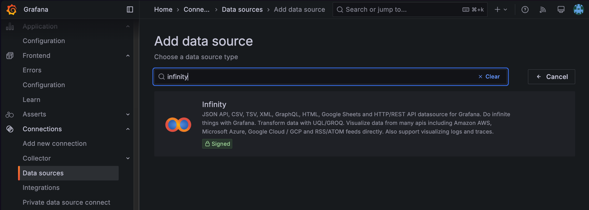
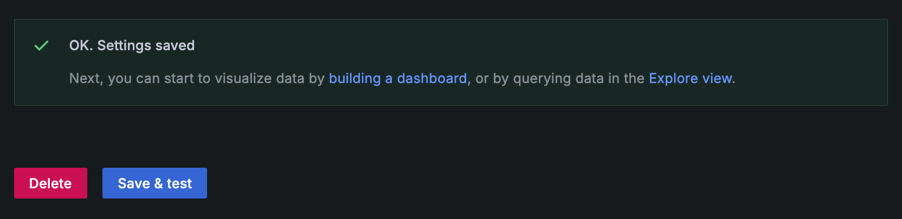
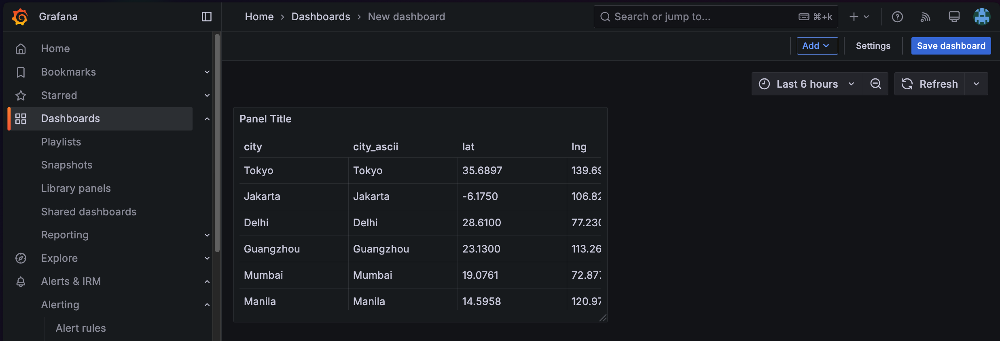

# Visualize any CSV Data with Grafana

Getting started with Grafana requires a basic understanding of how dashboards, datasources, and queries work.  In
this post, we'll go through a complete worked example of using Grafana to visualize any CSV file anywhere on the web.

We will:

1. Create a datasource that connects to the data
2. Create a dashboard that visualizes a query
3. (Optional) create a transform to change the CSV before visualizing it
4. Visualize the resulting data

This will give you all the concepts you need to build any kind of dashboard with Grafana.

## Create a Datasource

In the left hand navigation of Grafana, select "Connections > Data Sources".  Click the "Add a new Data source" button
in the top right corner.  Then, enter "Infinity" as the data source type.

**Note: do not select the CSV plugin**; while there is a plugin under that name, Infinity is much more flexible, actively maintained, and will give you super powers you'll learn about later in this post.

After you click the Infinity tile, you will arrive at this screen, which will prompt you to name the data source.

The default name is `yesoreyeram-infinity-datasource`, which we will keep for this example, but you can name it whatever you like.  This screen has the option to configure a lot of access parameters for any endpoints online; for example, if
you needed to provide a bearer token to access CSV at some endpoint, you could configure that in the Authentication section.

Click "Save and Test"

We'll be using a public dataset, so we can simply continue without customizing anything further.  

In Grafana, every data source comes with a _Query Editor_ that lets you specify what data you want. The data source is
a plugin that controls how the data is fetched.  The Infinity datasource lets you flexibly fetch any resource, from any
endpoint online that uses HTTP/HTTPS.

## Create a Dashboard

Using the lefthand nav, click "Dashboards".  In the resulting list, look for the "New" button in the upper right, and click "New Dashboard".

You'll land on an empty dashboard, which will prompt you to add a new visualization.  Let's start with a simple 
table, showing CSV data.  Click the "Add Visualization" button.

## Add Visualization

To create a visual in Grafana, we need to know where the data is coming from and what data it is.  So select the 
`yesoreyeram-infinity-datasource` datasource we created previously.

The next screenshot shows all of the selections we'll make. You can follow along by taking these steps:

1. In the query section at the bottom, choose `Type: CSV`
2. Ensure the source is `URL` and the method is `GET`
3. For the URL, enter `https://raw.githubusercontent.com/grafana/developer-advocacy/refs/heads/main/projects/Visualize%20CSV/data/worldcities.csv` which links to a CSV file full of data about world cities and their locations
4. In the upper right hand of the screen, choose "Table" as the visualization type.

That's it! You should see a table pop up displaying the data.

When you're finished, click the "Back to Dashboard" button, and we arrive at our new dashboard with one single visualization: a table of CSV data. At this point, we can click "Save Dashboard" and make sure we keep track of 
our progress.

## Adding another visualization: Map of World Cities

World cities exist on a map, and tables aren't that visually interesting, so let's add something nicer.  In the top
right of the dashboard, click Add > Visualization to create a new panel.

In the resulting screen, make the following choices to add a map:

1. Data source: `yesoreyeram-infinity-datasource`
2. Type: `CSV`
3. Method: `GET`
4. URL: same as above, `https://raw.githubusercontent.com/grafana/developer-advocacy/refs/heads/main/projects/Visualize%20CSV/data/worldcities.csv`
5. Visualization type (top right of screen): Geomap

In Grafana, [Geomap visualizations](https://grafana.com/docs/grafana/latest/panels-visualizations/visualizations/geomap/) require latitude and longitude information. But Grafana is smart enough to detect those fields in this dataset automatically. So you will get an automatically populated (but very busy) map, as pictured here:

You could save this visualization as-is and have a usable map. Mouse wheel scrolling zooms in and out, so you can inspect any region of the world you like.  But let's see if we can focus on the big cities, and teach one more key Grafana idea.

## Transforming and Filtering Data

Transformations in Grafana change the data before it gets visualized. In the query editor where we found the URL for
our datasource, you'll see a tab named Transformations.  Click it, and then click "Add Transformation".

We will add two transformations:

* **Convert Field Type** transformation to change the `population` field into a number (remember, CSV is all text!)
* **Filter Data by Values** transformation, to limit the dataset to only cities above a certain population.

You can find both of these transformation types like this:

After adding both transformations, your screen should look like this:

The order of these transformations is important. If you don't convert the field type to number first, then the "Greater than" option won't be available in "Filter data by values" since numerical operations don't apply to text from CSV.

Here, we've entered that we're interested in cities with more than 1 million people in population. Notice how much that clears up our map and simplifies it!

Finally, on the right hand side, let's give the panel a title. Then click "Back to Dashboard" and save your work.

## Conclusion

Congratulations, you've created a dashboard of publicly available CSV data. The same approach will work for _any kind of data_ behind any kind of HTTP or HTTPS URL, provided you can work with its format.  The process for visualizing any data
in Grafana is usually the same:

1. Define a datasource that lets you access the kind of data; there are [hundreds of datasources](https://grafana.com/grafana/plugins/data-source-plugins/) to choose from, for just about every system
2. Define a query to access; for CSV, we simply made an HTTPS GET to a URL; that's the query.
3. (Optional) Define a set of transformations that manipulate the data
4. Visualize the resulting data (in this example, we used a Table and a Geomap) but Grafana supports [dozens of visualization types](https://grafana.com/docs/grafana/latest/panels-visualizations/visualizations/) with support for many more through community plugins.
