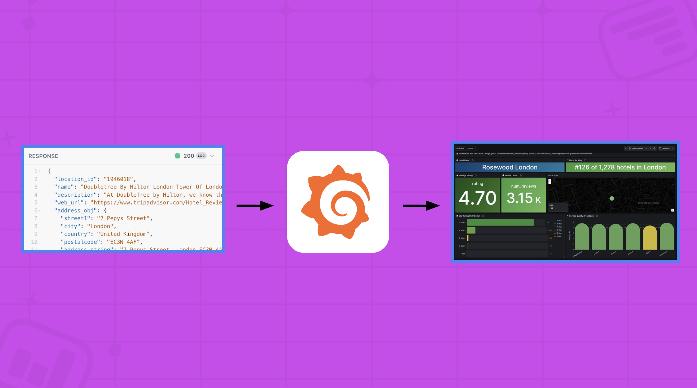
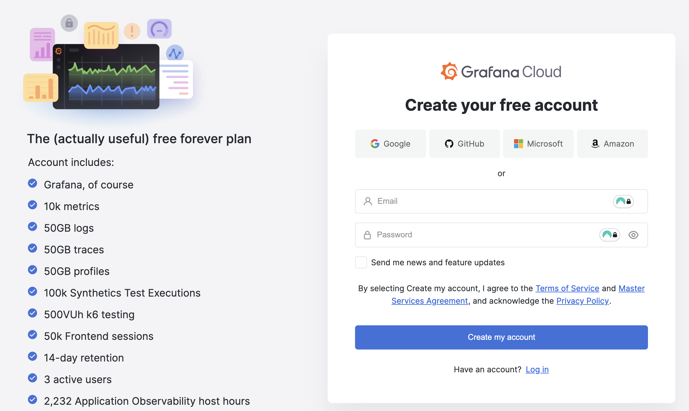
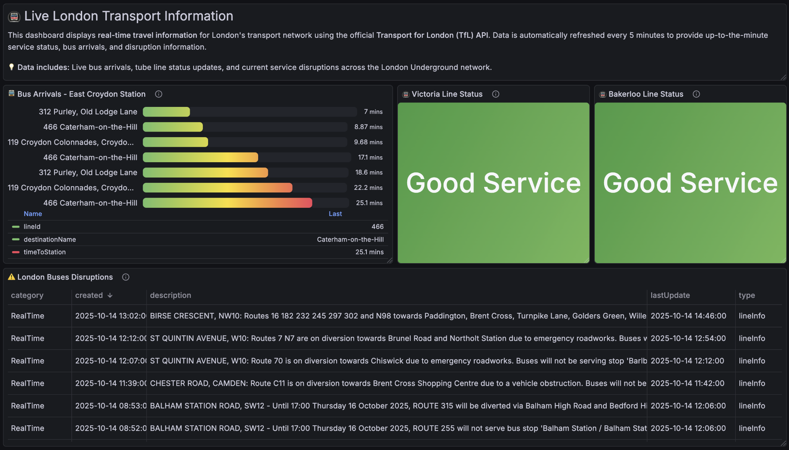

# Visualise your APIs with the Grafana Infinity Plugin

In this Grafana workshop, we will transform our API data into beautiful Grafana dashboards, using the versatile Infinity data source plugin! 📊



**No prior knowledge of Grafana is required as this workshop is beginner-friendly, but bring your laptops as this will be a hands-on workshop!**

For this workshop, we will use the [TfL API](https://api-portal.tfl.gov.uk/apis), but any public APIs can also be used.

## Sign up for Grafana Cloud

To make it easier for everyone to start learning about Grafana, please sign up to a [Grafana Cloud account](https://grafana.com/auth/sign-up/create-user) and start with the free forever plan.



## Install Infinity data source plugin

Infinity is not installed by default.

Please follow the instructions [here](https://grafana.com/docs/learning-journeys/infinity-json/install-data-source/) to install the Infinity plugin.

## Add the Infinity data source plugin

Once the plugin is installed, Infinity has to be added as a data source.

Please follow the instructions [here](https://grafana.com/docs/learning-journeys/infinity-json/add-data-source/) to add the Infinity plugin.

## Explore the TfL API

Feel free to explore the TfL API! Since these are all basic GET requests, you can just load them up from your browser of choice. You can start with the following requests:

### Get status of tube lines

```
https://api.tfl.gov.uk/Line/{{tubeLine}}/Status/{{fromDate}}/to/{{toDate}}
```

where:

- `{{tubeLine}}` - victoria, district, bakerloo
- `{{fromDate}}` - YYYY-MM-DD
- `{{toDate}}` - YYYY-MM-DD

example:

https://api.tfl.gov.uk/Line/victoria/Status/2025-11-05/to/2025-11-06

### Get real-time travel disruptions

```
https://api.tfl.gov.uk/Line/Mode/{{mode}}/Disruption
```

where:

- `{{mode}}` - bus, tube, dlr

Please visit https://api.tfl.gov.uk/Line/Meta/Modes to find all the available modes (`modeName`).

example:

https://api.tfl.gov.uk/Line/Mode/bus/Disruption

### Get real-time arrivals

```
https://api.tfl.gov.uk/StopPoint/{{NaptanID}}/Arrivals
```

where:

- {{NaptanID}} is a unique ID for every public transport access point in Great Britain.

Please visit https://raw.githubusercontent.com/ZackaryH8/tube-naptan/refs/heads/master/data/naptan.json to find all the naptan IDs for all tube stations in London.

example:

https://api.tfl.gov.uk/StopPoint/940GZZLUKSX/Arrivals

You can also use this [CSV file](https://tfl.gov.uk/bus-stops.csv) containing all the naptan IDs for different bus stops in London.

## Let's build a dashboard!

### Create a dashboard 

Please follow the instructions [here](https://grafana.com/docs/learning-journeys/visualization-metrics/add-visualization/) to create a new dashboard.

On step 5 (Search for and select a data source), select the **Infinity data source** that you just added.

### Write a query

Let's write a query to [get the status of the tube lines](#get-status-of-tube-lines).

1. Under the **Queries** tab, change the **Parser** from `JSONata` to `jq`.

> [!NOTE] 
>
> [jq](https://jqlang.org/) is a command-line processor for JSON data. It lets you parse, filter, transform, and extract JSON using a simple, expressive query language. 
>
> To get started with jq, try out the [JQ Playground](https://play.jqlang.org/) - an online sandbox where you can write, test, and visualize jq filters without installing jq locally.

2. Scroll down to the **URL** field and add: `https://api.tfl.gov.uk/Line/victoria/Status/${__from:date:YYYY-MM-DD}/to/${__to:date:YYYY-MM-DD}?detail=true`.

> [!NOTE] 
>
> Grafana has a built-in `${__from:date}` and `${__to:date}` variable that represents the start time and end time of the current dashboard or panel time range.

3. Set the time range to **Last 24 Hours**

> [!NOTE] 
>
> The TfL API throws an error if the from date and to date are the same date. For this example, we will set the dashboard time range to the last 24 hours.

4. Click the **Headers, Request params** button.
5. Under **HTTP Headers**, click **Add header** button.
6. Under **Key** field, add the value `User-Agent`.
7. Under **Value** field, add the value `Grafana`.

> [!NOTE]
>
> TfL's API requires a user agent for security purposes and to identify the application making the request.

8. To transform the query to only return the line status, expand the **Parsing options & Result fields** tab. On the **Rows/Root**, add `.[].lineStatuses`.
9. To verify your query, click the **Query Inspector** button, followed by the **Data** tab. You should see the query result.

### Select a visualization type

Grafana comes with different [visualization types](https://grafana.com/docs/grafana/latest/panels-visualizations/visualizations/). For this workshop, we will be using the stat, bar gauge, table, and text panels. 

> [!NOTE] 
>
> - A [stat](https://grafana.com/docs/grafana/latest/panels-visualizations/visualizations/stat/) visualization is used for displaying single values of interest.
> - A [bar gauge](https://grafana.com/docs/grafana/latest/panels-visualizations/visualizations/bar-gauge/) is used for displaying one or more numeric values as horizontal or vertical bars, similar to progress bars or battery indicators.
> - A [table](https://grafana.com/docs/grafana/latest/panels-visualizations/visualizations/table/) visualization is used for displaying data in one or more columns and rows.
> - Finally, a [text](https://grafana.com/docs/grafana/latest/panels-visualizations/visualizations/text/) visualization displays additional text or information about your dashboard using markdown or HTML.

To display the status of the tube lines, we'll use the stat visualization.

1. Under the **Visualization** section, select **Stat** from the dropdown.
1. Scroll down to **Fields** and select `StatusSeverityDescription`.
1. Give your panel a title and description
1. Click **Save dashboard** to save all the changes and make sure that the **Update default time range** is checked.

Now, have a go at doing the same visualization for other tube lines!

## Using Transformations

Now that you know the basics of Grafana, it's time to introduce you to some Grafana [transformations](https://grafana.com/docs/grafana/latest/panels-visualizations/query-transform-data/transform-data/). A transformation is a data-processing step that Grafana applies after your queries return data. 

You can apply transformations by clicking the **Transformations** tab.

  > [!NOTE]
  >
  > We will be using the following transformations:
  >
  > - **Filter fields by name** to remove unwanted fields or columns.
  > - **Sort by field** to sort your query based on a specified field.
  > - **Convert field type** to convert a field from one type to another. 
  > - **Organize fields by name** to rename, reorder, or hide fields returned by your query,

Have a go at visualising the other API responses, starting with:

- [Get real-time travel disruptions](#get-real-time-travel-disruptions) using the table panel.
- [Get real-time arrivals](#get-real-time-arrivals) using a bar gauge visualization.

We'll be here to assist you if you get stuck along the way.

Here's an [example dashboard](https://play.grafana.org/d/ec0c1486-03e6-4b64-bc80-11e764466e66/london-transport-tfl) which includes live bus arrivals, tube line status updates, and current service disruptions.



## (Optional) Use Grafana Assistant

[Grafana Assistant](https://grafana.com/docs/grafana-cloud/machine-learning/assistant) is our built-in AI-powered agent that helps you learn and solve problems in Grafana easier than ever.

You can try and ask Grafana Assistant to improve the visual look of your dashboard.
